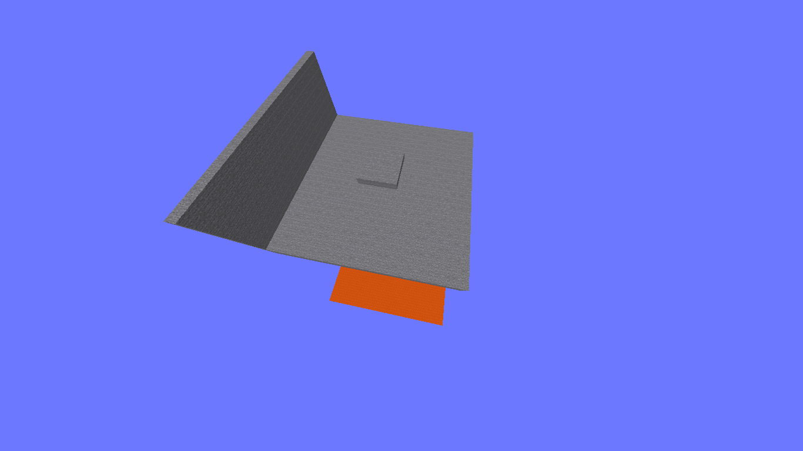

## Atualizações

### 1.3.1 (Novas músicas)

Meu canal no youtube, onde disponibilizarei as minhas músicas (no momento só publiquei "3 Minutos no Céu"): https://www.youtube.com/channel/UCgt7f8dTlllraIgpQ1GKJNQ

Corrigido erro em que levitação é cancelada quando você leva um dano (mesmo quando tú está sem hitstun).

Adicionadas 5 músicas novas, sendo estas:
Em uma Caverna Congelada; 

Tic-tac-tic-tac; 

O Fim; 

O Limbo e a Guerra; 

O Mistério da Árvore. 

Para poder usá-las, coloque a pasta "custom_music_discs_rp" em pacotes de recursos, os discos e as músicas estarão lá. Se você não fizer isso, nem as músicas nem os novos discos aparecerão.

Novo mapa: Floresta.

Adicionadas iluminações em várias áreas para quando a visão noturna estar desativada ser possível ver.

Explosivo:
| Característica | Antes | Depois |
| -------------- | ---- | ------ |
| Poção arremessável | 6s | 12s |
| Poção prolongada | 5s | 10s |
| Isqueiro: afiação e aspecto flamejante | Nível 2 | Nível 1

Vivo: arrumado inventário (espada de ferro, arco, escudo e peitoral são conseguidos com o villager em ambas as versões).
Barra de ataques nova:

Barra de ataques antiga:

### 1.3.0 (Update de Vida)

Mecânica do jogo: ar (sobre élitros): nome mudado para tempo no ar. Agora, em vez dele ser resetado quando você fica no chão, agora você perde 150 por 1/20s (3000 por segundo).

Agora, você pode escolher entre ter visão noturna (padrão) ou não (mais escuro).

Novo mapa: Caos Tridimensional.

Foram criados alguns mapas customizados, clique aqui: [Mapas customizados](./mapas%20customizados.md).

Fim: vel. de ataque: 4 -> 3.6. Olho da vida: absorção: 7 -> 3s. Barra de ação: mostra a pontuação "tempo de ar".

Nether: aspecto flamejante: nível 3 -> 2.

Minerador:
| Característica | Antes | Depois |
| -------------- | ---- | ------ |
| Vel. | 0.12 | 0.13 |
| Vida | 21 | 22 |
| Gravidade | alta (0.095)| normal (0.07)
(Agora, quando houver muita informação, essa tabela aparecerá)

Bancada de trabalho: recarga: 7 -> 15s. Pás: indestrutíveis e com repulsão 1.

Pesadelo: agora quando usadas, aranhas deixarão o tempo de dia.

Vivo: adicionado.

Barra de ataque:

### 1.2.4

Área de luta: de 1 a 10 (20 para cima) blocos fora do mapa, você será teleportado de volta ao mapa. Motivo: alguns personagens podem atravessar blocos, então é necessário ter isto.

Adicionados Ultra-Brutos - dobro de vida (100) - e desafio do Invocador - um invocador e dois pillagers com bestas (os vex terão decomposição infinita) -, ambos tem resistência total a repulsão.

Mapa piscina: nome alterado para palácio aquático, e forma alterada.

Novo:

Antigo:

Novo mapa: O Limbo.

Modo singleplayer (esqueletos, brutos e pillagers): adicionada alavanca que coloca partículas nos esqueletos, brutos e outros mobs por alavancas. Motivo: as vezes quando você perde uma vida e volta ao mapa, alguns inimigos ficam invisíveis sem um motivo (isso é um erro do Minecraft). Com a alavanca acionada, eles terão partículas de encantamento neles.

Hitstun: lembre-se, quando você não quiser ter ela, coloque a alavanca de "sem hitstun".

Arvoresco tem seus itens em área de treinamento e Aquático (guardião), Pesadelo (espada), Árido (flecha estranha) e Fim (cabeça de dragão e shulkerismo) ganham seus itens novos na mesma área.

Veneno, Árido, Explosivo, Estranho e Aquático: consertado erro em recargas de alguns ataques.

Fim: dano: 0.9 -> 0.3. Vel. de ataque: 4.1 -> 4. Besta: corrigida a forma em que ela carrega (agora você tem que tacá-la fora para ela voltar a recarregar).

Astronauta: resistência de repulsão: 0 -> 0.3.

### 1.2.3 (Troca-som)

Adicionado mapa "Troca-troca", se você entra nele 2 vezes seguidas, tem a chance de 2 paredes aparecerem ao mesmo tempo (então, para que isso não aconteça, use outro mapa na próxima partida (cancele ela se quiser) e use o Troca-troca depois).

Mapa novo:

Alavanca de modo singleplayer/multiplayer e hitstun: colocadas em área antes da partida.
Hitstun:
Há dois tipos de hitstun, o padrão e o 2.0. Ambas têm o propósito de não deixar você usar o pulo duplo quando levar dano.
<Padrão> Se você levar um dano entre 0.1 e 2.4, você não poderá usar o pulo duplo por um certo tempo (cada 0.1 de dano = -1/20 de segundo sem o pulo duplo, e o padrão é 2,5 segundos).
<2.0> Toda vez que você levar dano, durante 1 segundo você não pode dar um pulo duplo (não acumula).

Adicionadas músicas "3 Minutos no Céu" e "Um Pesadelo". Para poder usá-las, coloque a pasta "custom_music_discs_rp" em pacotes de recursos, os discos e as músicas estarão lá. Se você não fizer isso, nem as músicas nem os novos discos aparecerão.
Agora, todas as músicas poderão ser iniciadas automaticamente se você for na sessão "músicas" e clicar na placa de cima do som que você quiser ouvir no início da batalha (e o fim e além se a batalha acabar antes da música).

Logo: alterada para que também tenha a versão na imagem.

Modo singleplayer (esqueletos e brutos): agora eles não desaparecerão quando você morrer.

Festivo: corrigido erro em que escudo carrega se não estiver em seu slot padrão.

Nether: dano: 2 -> 1. Vel. de ataque: 4.3 -> 4.2. O Wither: 20s -> 30s.

Senhor das almas: um gráfico que mostra o crescimento de sua força comparada a vida.

Gráfico (de 30 de vida a 0, cada quadrado é igual a 1, força mínima=-1, máxima=3 (da esquerda para a direita)):

Morte: doença: alcance: 7 -> 4. Sem futuro: alcance: 10 -> 4. Assim, todos os ataques com cabeças ou crânios nesse personagem agora tem o alcance de 4.

Elétrico: sobrecarga agora te deixa imóvel por 8 segundos (mesmo tempo que dá força).

Arvoresco: abelhas: 25s -> 40s.

### 1.2.2

Área de treinamento: de 1 a 10 (20 para cima e baixo) blocos fora do mapa, você será teleportado de volta ao mapa. Área de luta terá isso no futuro.

Adiconada opção de manter o inventário ou deixar ele cair (como os itens são destruídos, você não pode pegá-los de novo).

Árido: Regeneração passiva: nível 2 -> 1. Flecha estranha: trocada invisibilidade por resistência 2 e agora são somente 2 flechas por vez.

Fim: dano: 1 -> 0.9. Defesa da cabeça: 3 -> 2. Cristal agora tem partícula para mostrar quando você usa o ataque.

Aquático: guardião: vida: 12 -> 3.

Astronauta: totem: 75s -> 100s. Defesa: 10 -> 9. Pulo duplo: O nível do efeito é 251, que faz seu pulo menor e tú cai mais lentamente.

Minerador: vida: 22 -> 21, besta e escudo: sem carga rápida ou maldição do desaparecimento (já que não funciona por conta do inventário continuar no jogador). Mesa: duração: 16s -> 13s. Recarga: 6s -> 7s.

Pesadelo: defesa: 12 -> 8, Aranhas: 30s -> 40s. Machado de netherita -> espada de netherita. Regeneração: Consertado bug em que ela não funcionaria, e agora, ela dura entre 1,5 e 3 segundos depois do tempo final.

### 1.2.1

Mapa: logo alterada e os nomes flutuantes no lobby "Outras Coisas", "Tutorial e Treinamento", "Configurações" e "Lutadores e Mapas" agora tem cores especiais (rosa, verde, ciano e dourado respectivamente).

Nova logo:

Veneno: defesa: 8 -> 7.

Aquático: guardião ancião (novo ataque): invoca um guardião ancião com 12 de vida e sem IA, ele te segue por 10 segundos, sua hurtbox empurra você, mas na maioria do tempo tú estará dentro dele (protegido). Dar um pulo duplo com ele pode ser catastrófico. Defesa: 10 -> 7.

Festivo: defesa: 7 -> 5. Adicionado outro foguete - que fica no inventário - e dá por volta de 14 de dano (tempo de recarga: 50s).

Astronauta hi-tech: defesa: 12 -> 10. Mecanismo de ressussitação: 50s -> 75s de recarga.

Metálico: vida: 19 -> 17.

### 1.2.0

Adicionado Arvoresco (com tutorial e visualização de personagem).

Corrigido erro no qual quando você sai de uma partida (sem ter marcado a quantidade de tempo padrão) e quando tentar entrar em outra, o tempo é marcado como 0 segundos (agora, é -1, que lhe permite jogar sem tempo).

### 1.1.1

Árido: Regeneração passiva: nível 3 -> 2. Consertado bug em que essa regeneração não funcionaria.

Fim: adicionado shulkerismo: invoca um projétil de shulker 3 blocos acima de todos a 10 blocos de distância (menos tú). cooldown: 25s e quando o item é usado enquanto não está carregado, recupera 1/20 de segundo do ataque.

### 1.1.0

Agora, Senhor das almas, Elétrico e Morte têm seus itens na área de treinamento, "área de desenvolvedores" agora pode ser entrada por todos e se chama "resetar pontuações", Elétrico tem sua visualização de personagem.

Adicionado o mapa "Palácio Aquático".

Explosivo: adicionado "kamikaze", ataque que começa a carregar quando sua vida está em 4 ou menos, demora 5 segundos (esse tempo não reseta quando sua vida fica acima de 4), e quando carrega, pode ser usado a qualquer momento.
O ataque invoca um fogo de artifício com 3 explosões grandes e 2 pequenas, ele explode instantaneamente, e dá por volta de 14 de dano à entidades próximas.

Árido: regeneração passiva: nível 1 -> nível 3. Defesa: 13 -> 12. Adicionado balde de leite.

Nether: visão quente: tempo de duração da área de efeito: 13/20s -> 6/20s (assim permitindo que você possa correr na direção da área de efeito).

Metálico: set de chumbo: botas e capacete: -2 de vida -> -1 de vida cada, peitoral e calça: -2 de vida -> -3 de vida cada. Set de aço: durabilidade: 15 -> 20.

Elétrico: defesa: 9 -> 7. Velocidade: 0.163 -> 0.143. Sobrecarga: 0.5km -> 0.4km necessários.

### 1.0.1

Elétrico agora tem tutorial, tutorial básico e gravidade agora estão separados, criada "área de desenvolvedores", que permite que jogadores com o nome "gui" ou "zekkious" entrem e possam resetar todas as suas pontuações, atualizado o tutorial básico e Mineiro agora usa picareta de ouro em vez de espada como arma inicial.

### 1.0.0

Atualizada a README.