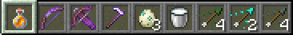
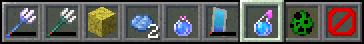
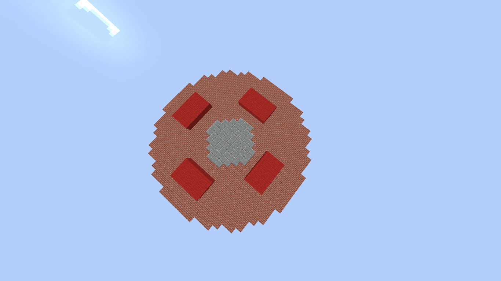
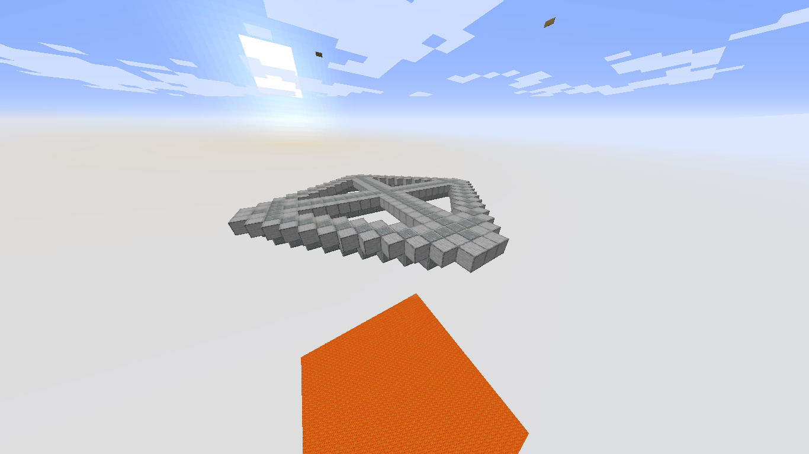

## Atenção: Esta página contem muitas imagens.

# Lutadores

## 1. Guerreiro da neve

#### Atributos:
Vida:18 (20=padrão), Dano:1.1 (1=padrão), Velocidade:0.14 (0.1=padrão), Velocidade de ataque:4.1 (4=padrão), Resistência a repulsão:0.3 (0=padrão, máximo=1) e defesa: 10 (6 do peitoral).

Barra de ataques:

Lutador:

## 2. Veneno

#### Atributos:
Vida:34, Dano:-3.5, Velocidade:0.18, Velocidade de ataque:7, Resistência a repulsão:0.1 e defesa:7.

## 3. Natural

#### Atributos:
Vida:20, Dano:1.3, Velocidade:0.13, Velocidade de ataque:3.7, Resistência a repulsão:0.3 e defesa:9.

## 4. Árido

#### Atributos:
Vida:24, Dano:1, Velocidade:0.09, Velocidade de ataque:3.9, Resistência a repulsão:0.7 e defesa:12.

## 5. Explosivo

#### Atributos:
Vida:23, Dano:1.3, Velocidade:0.105, Velocidade de ataque:4.8, Resistência a repulsão:0.6 e defesa:6.

## 6. Estranho

#### Atributos:
Vida:22, Dano:1.3, Velocidade:0.15, Velocidade de ataque:4.3, Resistência a repulsão:0 e defesa:7.

## 7. Fim

#### Atributos:
Vida:40, Dano:0.3, Velocidade:0.11, Velocidade de ataque:4, Resistência a repulsão:0.2 e defesa:1-3.

## 8. Morto

#### Atributos:
Vida:28, Dano:5, Velocidade:0.09, Velocidade de ataque:4.2, Resistência a repulsão:0.4 e defesa:4-8-13-18.

## 9. Aquático

#### Atributos:
Vida:17, Dano:1.1, Velocidade:0.154, Velocidade de ataque:4, Resistência a repulsão:0 e defesa:7.

## 10. Festivo

#### Atributos:
Vida:24, Dano:1.8-0, Velocidade:0.145-0.13-0.12, Velocidade de ataque:24, Resistência a repulsão:0.2 e defesa:5.

## 11. Astronauta hi-tech

#### Atributos:
Vida:25, Dano:1, Velocidade:0.085, Velocidade de ataque:3.5, Resistência a repulsão:0.3 e defesa:9.

## 12. Nether

#### Atributos:
Vida:27, Dano:1, Velocidade:0.12, Velocidade de ataque:4.2, Resistência a repulsão:0.3 e defesa:8.

## 13. Metálico

#### Atributos:
Vida:17, Dano:1, Velocidade:0.1, Velocidade de ataque:4, Resistência a repulsão:0.4 e defesa:0.

## 14. Minerador

#### Atributos:
Vida:21, Dano:1, Velocidade:0.12, Velocidade de ataque:4.3, Resistência a repulsão:0.7 e defesa:0.

## 15. Pesadelo

#### Atributos:
Vida:19, Dano:1, Velocidade:0.1, Velocidade de ataque:3.5, Resistência a repulsão:0.1 e defesa:8.

## 16. Senhor das almas

#### Atributos:
Vida:30, Dano:-1 até 3, Velocidade:0.09-0.16, Velocidade de ataque:3.8-4.2, Resistência a repulsão:0.1 e defesa:7.

Gráfico de força (de 30 de vida a 0, cada quadrado é igual a 1, força mínima=-1, máxima=3 (da esquerda para a direita)):

## 17. Morte

#### Atributos:
Vida:50, Dano:1, Velocidade:0.17, Velocidade de ataque:4, Resistência a repulsão:0.3 e defesa:0.

## 18. Elétrico

#### Atributos:
Vida:16, Dano:1, Velocidade:0.143, Velocidade de ataque:4, Resistência a repulsão:0.6 e defesa:7.

## 19. Arvoresco

#### Atributos:
Vida:20, Dano:1, Velocidade:0.1, Velocidade de ataque:4, Resistência a repulsão:0.2 e defesa:7.

## 20. Vivo

#### Atributos:
Vida:36, Dano:0.5, Velocidade:0.13, Velocidade de ataque:4, Resistência a repulsão:0.5 e defesa:21-13-11-3.

# Mapas

## 0-0

## Seleção de lutadores

## Área de treinamento

## Visualização e seleção de mapas

## Mapa 1: Donut da batalha

## Mapa 2: Campo e rio subterrâneo

## Mapa 3: Rua

## Mapa 4: Rei da montanha

## Mapa 5: Bibloteca

## Mapa 6: Campo de batalha

## Mapa 7: Labirinto de 2 andares

## Mapa 8: 6/l

## Mapa 9: 6/L

## Mapa 10: Ilha púrpura

## Mapa 11: Deserto

## Mapa 12: Labirinto de 2 andares 2.0

## Mapa 13: Nether

## Mapa 14: O fim

## Mapa 15: Pula-pula

## Mapa 16: Cruz Grega Circulada (CGC)

## Mapa 17: Palácio Aquático

## Mapa 18: Troca-troca

## Mapa 19: O Limbo

## Mapa 20: Floresta

## Mapa 21 (22): Caos Tridimensional

